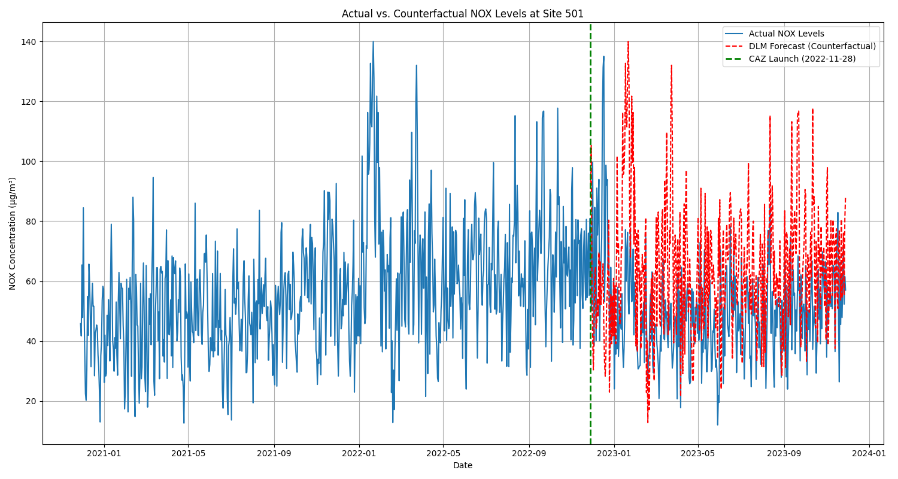

# Bristol Clean Air Zone (CAZ) Analysis

## Project Description

This project provides a data-driven analysis of the Bristol Clean Air Zone (CAZ) using publicly available data from pollution sensor nodes. The core of this analysis is to evaluate the effectiveness and statistical significance of the CAZ in improving air quality and to model what pollution levels might have been without its introduction. Furthermore, the project explores the relationship between vehicle traffic composition and air quality, with a specific focus on heavy goods vehicles (HGVs), to form a foundation for future research hypotheses.

## Features

1. Data Ingestion & Preprocessing: Scripts to gather, clean, and prepare data from pollution sensor nodes and traffic counters for analysis.

2. Difference-in-Differences Model: An analysis using this statistical method to assess the significant impact of the CAZ implementation on pollution levels.

3. SARIMAX Forecasting: A SARIMAX (Seasonal Autoregressive Integrated Moving Average with Exogenous Regressors) model used to forecast a baseline pollution level, predicting what pollution would have been without the introduction of the CAZ.

4. Traffic & Correlation Analysis: An investigation into traffic data from before and after the CAZ implementation, comparing data from inside and outside the zone. Correlation matrices were used to explore the relationship between the number of heavy goods vehicles (HGVs) and pollution levels, forming a basis for further hypothesis testing.

## Key Findings

### Difference-in-Differences (DiD) Analysis
The DiD model results indicate a statistically significant negative effect of the Bristol Clean Air Zone on Nitrogen Oxides (NOx) pollution levels.

* is_treated: The positive coefficient for this term suggests a baseline difference in NOx levels between the treated (inside the CAZ) and control (outside the CAZ) groups before the policy was implemented.

* is_post: The non-significant coefficient for this term indicates that there was no meaningful change in pollution levels in the control group over time.

* is_post_treated: The coefficient for the key interaction term is -18.2251 and is highly statistically significant (P∣t∣ of 0.000). This result suggests that the CAZ led to a decrease of approximately 18.23 units in NOx levels for the treated group, a reduction that can be directly attributed to the policy's implementation and is not due to general trends over time.

### SARIMAX Model Analysis

The SARIMAX model was used to create a counterfactual forecast of what NOx pollution levels would have been without the implementation of the CAZ.

* Model Specification: The model, specified as SARIMAX(1,0,0)x(0,1,0,365), effectively captures both the short-term autoregressive trends and the strong yearly seasonality present in the pollution data.

* Coefficients: The autoregressive term ar.L1 has a coefficient of 0.3786, which is highly statistically significant (P∣z∣ of 0.000). This indicates that NOx levels from the previous day are a significant predictor of the current day's pollution levels.

* Model Fit: The low AIC and BIC values suggest that the model provides a good fit for the data. Diagnostic checks, such as the Ljung-Box test, show that the model's residuals do not have significant remaining serial correlation, which is an indicator of a well-specified model for forecasting.

## Discussion & Limitations

While the findings are compelling, it is important to consider the limitations of the analysis. The Difference-in-Differences model relies on the assumption of parallel trends, meaning that in the absence of the CAZ, the treated and control groups would have followed similar pollution trajectories. While this assumption is supported by pre-policy data, external factors not captured in the model, such as changes in weather patterns or broader economic shifts, could influence the results.

Additionally, the analysis is primarily based on data from a limited number of pollution sensor nodes. While these provide valuable insights, they may not fully capture the full complexity and variability of air quality across the entire city of Bristol. The conclusions drawn are therefore representative of the areas around these sensors.

## Future Work

This project provides a strong foundation for future research and analysis. Potential next steps include:

1. Expanding Data Sources: Incorporating data from more pollution sensors and traffic counters to create a more comprehensive view of the city.

2. Exploring Causality: Employing more advanced causal inference methods to further isolate the effects of the CAZ.

3. Comparative Analysis: Applying the same methodology to other UK cities with Clean Air Zones to compare their effectiveness and identify best practices.

4. Incorporating Exogenous Variables: Adding other variables to the SARIMAX model, such as weather data (e.g., wind speed, temperature) and specific traffic compositions (e.g., number of buses, cars), to improve forecast accuracy and gain a deeper understanding of the factors influencing pollution.

## Technologies Used

* Python: The core programming language for the analysis.

* Pandas: For data manipulation and analysis.

* NumPy: For numerical operations.

* Matplotlib / Seaborn: For creating static data visualizations.

* Jupyter Notebooks: For interactive development and presenting the analysis.

## Data Sources
* Bristol City Council Open Data (specifically pollution sensor nodes)

* UK Government air quality monitoring data

* Department for Transport (DfT) vehicle statistics

## Repository Contents

* `data/`: Raw and processed data files.
* `img/`: Images from project.
* `notebooks/`: Jupyter notebooks detailing the data exploration, preprocessing and statistical analysis.
* `README.md`: This file.
* `requirements.txt`: A list of all necessary Python libraries to run the project.
